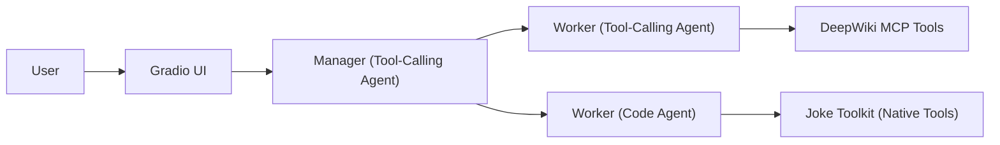
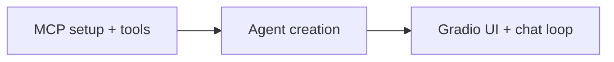

# Smolagents Quickstart Template

Ready-to-use template for building multi-agent apps with Smolagents. It ships with:
- Gradio chat UI
- MCP client manager
- A manager agent coordinating two worker agents (tool-calling + code)

Use this as a minimal, extensible starting point to create your own agents, tools, and UIs.

## Overview

- Manager agent delegates to two workers:
	- Tool-calling worker uses DeepWiki MCP tools (queries public GitHub repos).
	- Code worker uses a native Joke toolkit (`get_joke`).
- `MCPManager` loads clients from JSON and exposes their tools to agents.
- `GradioAgentUI` launches a chat interface for the manager agent.

Simple flow:



## Quick Start

Prereqs: Python 3.13+, and `uv` for dependency management.

```zsh
# Clone and enter the project
git clone <this-repo-url>
cd smolagents-quickstart-template
```

```zsh
# Create your environment from pyproject/uv.lock
uv sync
```

```zsh
# Copy env and fill required values
cp env.example .env
```

Edit `.env` and set at least:
- `LITELLM_MODEL_ID` (e.g., `gemini/gemini-2.5-flash` or your preferred model id)
- `LITELLM_API_KEY` (API key for the selected model provider)
- `MCP_CONFIG_PATH=mcp_manager/mcp_config.json` (path to the included MCP config)

Notes:
- The included MCP config defines a `deepwiki` client using streamable-http.
- Other env entries are optional unless you run your own MCP servers.

## LLM Models

This template uses `LiteLLMModel` in the example agents so you can plug into many providers with a single interface.
- Configure via `.env`: set `LITELLM_MODEL_ID` and `LITELLM_API_KEY`.
- Examples: `gemini/gemini-2.5-flash`, `openai/gpt-4o-mini`, etc. (provider/model naming per LiteLLM conventions).
- You can swap to other Smolagents-supported backends by replacing `LiteLLMModel` in your agents.

See Smolagents docs for supported model backends and parameters:
- Docs: https://huggingface.co/docs/smolagents
- GitHub (examples): https://github.com/huggingface/smolagents

## Run

Launch the manager agent with a Gradio chat UI:

```zsh
uv run python app.py
```

The terminal will print the Gradio URLs (local and a temporary share link). Open the printed URL in your browser to chat with the manager agent.

## Architecture

- Manager Agent (`ExampleManagerAgent`): Orchestrates work and delegates to workers.
- Tool-Calling Worker (`ExampleToolCallingAgent`): Uses DeepWiki MCP tools for repo knowledge.
- Code Worker (`ExampleCodeAgent`): Uses a native Joke toolkit (`get_joke`).


High-level flow (from `main.py`):

1. Initialize `MCPManager` and set up MCP clients (`setup_clients`).
2. Fetch tools: MCP tools from `deepwiki` and native tools from `ExampleJokeToolkit`.
3. Create workers: `ExampleToolCallingAgent` (MCP tools) and `ExampleCodeAgent` (native tools).
4. Create `ExampleManagerAgent` with `managed_agents=[tool_calling_agent.agent, code_agent.agent]`.
5. Launch the Gradio chat UI via `GradioAgentUI(agent=manager_agent).launch()`.
6. On exit, disconnect MCP clients (`mcp_manager.disconnect_all()`).

Simple phases diagram:



## Project Structure

- `app.py`: Entrypoint (`python app.py` calls `main()`).
- `main.py`: Wires MCP clients, builds agents, launches the Gradio UI.
- `agents/`
	- `base_agent.py`: Base classes for simple and manager agents.
	- `example_tool_calling_agent.py`: Tool-calling worker using DeepWiki MCP tools.
	- `example_code_agent.py`: Code worker using a native Joke toolkit.
	- `example_manager_agent.py`: Manager agent coordinating the workers.
- `toolkits/example_joke_toolkit.py`: Native tool (`@tool get_joke`) exposed to agents.
- `prompts/prompts.py`: Instruction strings for each example agent.
- `mcp_manager/`
	- `mcp_manager.py`: Loads MCP client configs and exposes tools.
	- `mcp_config.json`: Example config with a `deepwiki` client.
- `ui/`
	- `gradio_agent_ui.py`: Minimal Gradio chat wrapper for an agent.
	- `base_ui.py`: UI abstraction.
- `env.example`: Template for `.env` variables.
- `pyproject.toml`: Project metadata and dependencies.

## Customize & Extend

### Create a New Agent
1) Add a file under `agents/` and inherit from `BaseAgent` (or `BaseManagerAgent`).
2) Inside `__init__`, build a Smolagents agent (`ToolCallingAgent` or `CodeAgent`) and assign it to `self.agent`.

Example (tool-calling agent skeleton):
```python
# agents/my_agent.py
import os
from smolagents.agents import ToolCallingAgent
from smolagents import LiteLLMModel, Tool
from agents.base_agent import BaseAgent
from prompts import prompts

class MyAgent(BaseAgent):
	def __init__(self, tools: list[Tool]):
		super().__init__()
		self.agent = ToolCallingAgent(
            ...
        )

	def run(self, message, history=None):
		return self.agent.run(message)
```

Example (code agent skeleton):
```python
# agents/my_code_agent.py
import os
from smolagents.agents import CodeAgent
from smolagents import LiteLLMModel, Tool
from agents.base_agent import BaseAgent
from prompts import prompts

class MyCodeAgent(BaseAgent):
	def __init__(self, tools: list[Tool]):
		super().__init__()
		self.agent = CodeAgent(
            ...
        )

	def run(self, message, history=None):
		return self.agent.run(message)
```

Tip: Both agents accept additional parameters (e.g., `return_full_result`, step limits, etc.). See Smolagents docs for details:
- Docs: https://huggingface.co/docs/smolagents
- API reference and examples: https://github.com/huggingface/smolagents

### Add Prompts
- Put instruction strings in `prompts/prompts.py` (e.g., `MY_AGENT_INSTRUCTIONS = "..."`).
- Reference them via the `instructions=` parameter when constructing the agent.

### Add Native Toolkits
1) Create a function in `toolkits/` and decorate with `@tool`.
2) Return it in a `get_tools()` list for easy import.

```python
# toolkits/my_tools.py
from smolagents import tool

@tool
def my_utility(x: int) -> int:
	return x * 2

class MyToolkit:
	@staticmethod
	def get_tools():
		return [my_utility]
```

### Add MCP Clients/Tools
1) Edit `mcp_manager/mcp_config.json` to add a client, for example:
```json
{
	"deepwiki": { "url": "https://mcp.deepwiki.com/mcp", "transport": "streamable-http" },
	"my_client": { "url": "https://my-mcp.example.com/mcp", "transport": "streamable-http" }
}
```
2) Ensure `.env` has `MCP_CONFIG_PATH=mcp_manager/mcp_config.json` (or your custom path).
3) In `main.py`, fetch tools with `mcp_manager.get_tools("my_client")`.

### Compose Agents in `main.py`
- Import your agents and toolkits, instantiate them, pass tools, then include them in the manager’s `managed_agents` list and UI:

```python
import os
from mcp_manager.mcp_manager import MCPManager
from toolkits.my_tools import MyToolkit
from agents.example_tool_calling_agent import ExampleToolCallingAgent
from agents.example_code_agent import ExampleCodeAgent
from agents.example_manager_agent import ExampleManagerAgent
from ui.gradio_agent_ui import GradioAgentUI

# 1) Setup MCP manager and clients
mcp_manager = MCPManager(os.getenv("MCP_CONFIG_PATH", "mcp_manager/mcp_config.json"))
mcp_manager.setup_clients()

# 2) Fetch tools
deepwiki_tools = mcp_manager.get_tools("deepwiki")
joke_tools = MyToolkit.get_tools()

# 3) Create workers
tool_worker = ExampleToolCallingAgent(tools=deepwiki_tools)
code_worker = ExampleCodeAgent(tools=joke_tools)

# 4) Create manager and launch UI
manager_agent = ExampleManagerAgent(tools=[], managed_agents=[tool_worker.agent, code_worker.agent])
ui = GradioAgentUI(agent=manager_agent)
ui.launch()
```

### UI Options
- Change host/sharing in `ui/gradio_agent_ui.py` (`server_name`, `share`).

## Troubleshooting
- No MCP tools? Verify `MCP_CONFIG_PATH` points to a valid JSON (e.g., `mcp_manager/mcp_config.json`).
- Model/auth errors? Set `LITELLM_MODEL_ID` and `LITELLM_API_KEY` in `.env`.
- Connectivity issues? Ensure your network can reach the MCP endpoint(s).

## References
- Smolagents documentation: https://huggingface.co/docs/smolagents
- Smolagents GitHub (examples, issues): https://github.com/huggingface/smolagents

