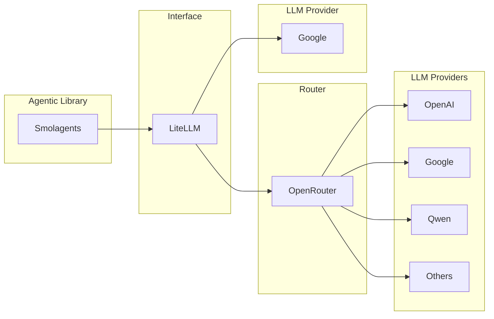

# API Key Setup Guide

This guide explains how to get API keys for running your Smolagents project. You'll learn about different AI providers and how to configure them.

## What You Need to Know First



**How it works:**
- Smolagents uses LiteLLM to talk to AI models.
- LiteLLM can send requests to either OpenRouter or Google AI Studio.
- OpenRouter itself can route to many different providers (OpenAI, Google, Anthropic, etc).

### What is LiteLLM?
**LiteLLM** is a library that provides a unified interface for different AI models. Instead of learning separate APIs for each provider, you can use one simple interface that works with OpenAI, Google, Anthropic, and many others.

Think of it like a universal remote control - one interface, many different devices.

### What is Google AI Studio?
**Google AI Studio** is Google's platform for accessing their Gemini AI models. It's free to use (with limits) and great for beginners. You get access to powerful models like Gemini 2.5 Flash.

### What is OpenRouter?
**OpenRouter** is a service that provides access to many different AI models from various providers through one API. It's like a marketplace for AI models - you can access models from OpenAI, Anthropic, Google, and others all in one place.

## Option 1: Google AI Studio (Recommended for Beginners)

### Step 1: Get Your API Key

1. Go to [Google AI Studio](https://aistudio.google.com/)
2. Sign in with your Google account
3. Click "Get API Key" in the sidebar
4. Click "Create API Key"
5. Copy your API key (it starts with `AIza...`)

### Step 2: Configure Your Environment

Edit your `.env` file:

```bash
# For Google AI Studio:
LITELLM_MODEL_ID=gemini/gemini-2.5-flash
LITELLM_API_KEY=AIza_your_api_key_here

# Agent workspace (already set):
AGENT_WORKSPACE_PATH=data/agent_workspace
```

### Available Google Models

You can find all available Gemini models in [Google AI Studio](https://aistudio.google.com/). Some popular options:

- `gemini/gemini-2.5-flash` - Fast and efficient (recommended)
- `gemini/gemini-2.5-flash-lite` - Lighter, faster and cheaper
- `gemini/gemini-2.0-flash` - Older but stable version

**NOTE: Some LLMs do not support tool-calling functionality. When selecting an LLM, make sure it supports the features you need.**

### Rate Limits

Google AI Studio has generous free limits, but be aware of them:
- Visit [Google AI Rate Limits Documentation](https://ai.google.dev/gemini-api/docs/rate-limits) for current limits
- Free tier includes thousands of requests per month
- Paid plans available for higher usage

## Option 2: OpenRouter (More Model Variety)

### Step 1: Get Your API Key

1. Go to [OpenRouter](https://openrouter.ai/)
2. Sign up for an account
3. Go to "API Keys" in your dashboard
4. Create a new API key
5. Copy your API key (it starts with `sk-or-...`)

### Step 2: Configure Your Environment

Edit your `.env` file:

```bash
# For OpenRouter:
LITELLM_MODEL_ID=openrouter/google/gemini-2.5-flash
LITELLM_API_KEY=sk-or-your_openrouter_key_here

# Agent workspace (already set):
AGENT_WORKSPACE_PATH=data/agent_workspace
```

### Available Models

OpenRouter provides access to many open-source and closed-source models. Browse all available models at [OpenRouter Models](https://openrouter.ai/models).

**Important:** OpenRouter model names are different from Google AI Studio!

Some popular options:
- `openrouter/google/gemini-2.5-flash` - Google's Gemini via OpenRouter (routes to Google AI Studio)
- `openrouter/x-ai/grok-4-fast:free` - Grok's 4 Fast model (free tier)
- `openrouter/z-ai/glm-4.5-air:free` - A lightweight model from Z AI (free tier)
- `openrouter/openai/gpt-oss-20b:free` - Open-source GPT model (free tier)
- `openrouter/moonshotai/kimi-k2:free` - Moonshot AI's Kimi K2 model (free tier)

### Pricing

OpenRouter uses pay-per-use pricing:
- Check current prices on their [models page](https://openrouter.ai/models)

OpenRouter provides a free tier option which with limited usage you can access many free models from different providers like Qwen, Grok, Kimi, etc. You can start with these free models for your project.

## Key Differences to Remember

| Provider | Model Name Format | Example |
|----------|-------------------|---------|
| Google AI Studio | `gemini/model-name` | `gemini/gemini-2.5-flash` |
| OpenRouter | `openrouter/provider/model-name` | `openrouter/google/gemini-2.5-flash` |

**⚠️ Important:** Don't mix up the model names! If you have a Google AI Studio key, use the `gemini/` format. If you have an OpenRouter key, use the `openrouter/` format.

## Testing Your Setup

After setting up your API key:

1. Run your project: `./run.sh`
2. If you see the Gradio URL, your setup worked!
3. Try asking: "Hello, can you tell me a joke?"

### Troubleshooting

**"Invalid API key" error:**
- Double-check you copied the full API key
- Make sure the model name matches your provider
- Check for extra spaces in your `.env` file

**"Rate limit" error:**
- You've hit your usage limit
- Wait a few minutes/hours depending on the limit
- Consider upgrading to a paid plan

**"Model not found" error:**
- Check the model name is correct for your provider
- Visit the provider's website to confirm the model exists

## Security Tips

1. **Never share your API keys** - They're like passwords!
2. **Don't commit `.env` files** to Git repositories
3. **Regenerate keys** if you think they're compromised
4. **Monitor your usage** to avoid unexpected charges

## Getting Help

- **Google AI Studio Issues:** Check [Google's documentation](https://ai.google.dev/gemini-api/docs)
- **OpenRouter Issues:** Check [OpenRouter's docs](https://openrouter.ai/docs)
- **LiteLLM Issues:** Check [LiteLLM documentation](https://docs.litellm.ai/)

## Next Steps

Once you have your API key working:
1. Read the [How-To Guide](how_to.md) for exercises and tutorials
2. Experiment with different models to see their personalities
3. Try building your own tools and agents!

Remember: Start with small experiments and gradually build more complex projects as you learn.
