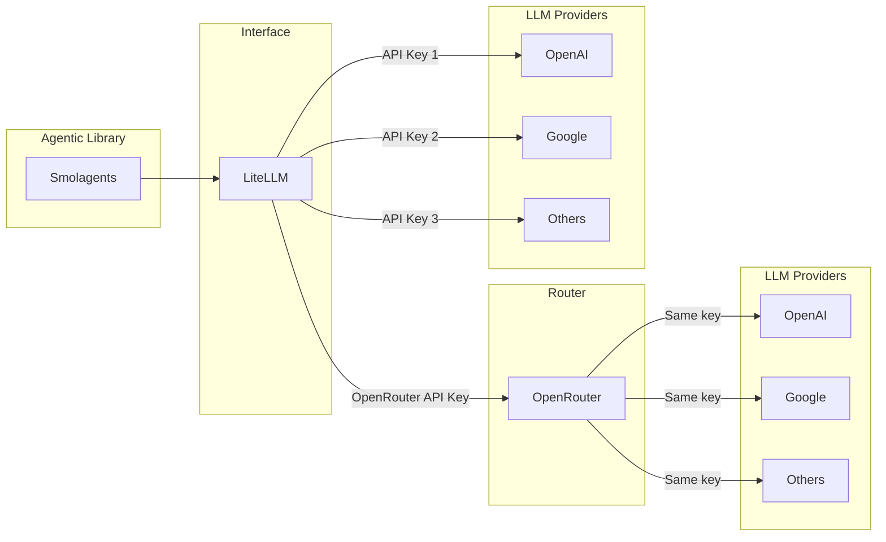

# API Anahtarı Kurulum Rehberi

Bu rehber, Smolagents projenizi çalıştırmak için API anahtarlarını nasıl alacağınızı açıklıyor. Farklı AI sağlayıcıları hakkında bilgi edinecek ve bunları nasıl yapılandıracağınızı öğreneceksiniz.

## Önce Bilmeniz Gerekenler


**Nasıl çalışıyor:**
- Smolagents, AI modelleriyle konuşmak için LiteLLM kullanıyor.
- LiteLLM istekleri ya OpenRouter'a ya da Google AI Studio'ya gönderebiliyor.
- OpenRouter kendisi birçok farklı sağlayıcıya (OpenAI, Google, Anthropic vb.) yönlendirebiliyor.

**Not:**
Eğer LiteLLM'i her sağlayıcıya doğrudan bağlanmak için kullanırsanız, her biri için ayrı bir API anahtarına ihtiyacınız var (OpenAI, Google vb.). Eğer OpenRouter kullanırsanız, birden fazla sağlayıcıya erişmek için sadece tek bir OpenRouter anahtarına ihtiyacınız var.

### LiteLLM Nedir?
**LiteLLM**, farklı AI modelleri için birleşik bir arayüz sağlayan bir kütüphanedir. Her sağlayıcı için ayrı API'leri öğrenmek yerine, OpenAI, Google, Anthropic ve daha birçokları ile çalışan basit bir arayüz kullanabilirsiniz.

Bunu evrensel bir uzaktan kumanda gibi düşünün - tek arayüz, birçok farklı cihaz.

### Google AI Studio Nedir?
**Google AI Studio**, Google'ın Gemini AI modellerine erişim için sunduğu platformdur. Ücretsiz kullanabilirsiniz (sınırlamalarla) ve yeni başlayanlar için mükemmeldir. Gemini 2.5 Flash gibi güçlü modellere erişim sağlarsınız.

### OpenRouter Nedir?
**OpenRouter**, çeşitli sağlayıcılardan birçok farklı AI modeline tek bir API üzerinden erişim sağlayan bir servis. AI modelleri için bir pazar yeri gibi - OpenAI, Anthropic, Google ve diğerlerinden gelen modellere tek bir yerden erişebilirsiniz.

## Seçenek 1: Google AI Studio (Yeni Başlayanlar İçin Önerilir)

### Adım 1: API Anahtarınızı Alın

1. [Google AI Studio](https://aistudio.google.com/)'ya gidin
2. Google hesabınızla giriş yapın
3. Kenar çubuğunda "Get API Key"e tıklayın
4. "Create API Key"e tıklayın
5. API anahtarınızı kopyalayın (`AIza...` ile başlar)

### Adım 2: Ortamınızı Yapılandırın

`.env` dosyanızı düzenleyin:

```bash
# Google AI Studio için:
LITELLM_MODEL_ID=gemini/gemini-2.5-flash
LITELLM_API_KEY=AIza_buraya_api_anahtarınız

# Agent çalışma alanı (zaten ayarlı):
AGENT_WORKSPACE_PATH=data/agent_workspace
```

### Kullanılabilir Google Modelleri

Tüm mevcut Gemini modellerini [Google AI Studio](https://aistudio.google.com/)'da bulabilirsiniz. Bazı popüler seçenekler:

- `gemini/gemini-2.5-flash` - Hızlı ve verimli (önerilir)
- `gemini/gemini-2.5-flash-lite` - Daha hafif, hızlı ve ucuz
- `gemini/gemini-2.0-flash` - Daha eski ama stabil sürüm

**NOT: Bazı LLM'ler tool-calling işlevini desteklemez. Bir LLM seçerken, ihtiyaç duyduğunuz özellikleri desteklediğinden emin olun.**

### Kullanım Sınırları

Google AI Studio cömert ücretsiz sınırlara sahip, ama bunları bilin:
- Güncel sınırlar için [Google AI Rate Limits Documentation](https://ai.google.dev/gemini-api/docs/rate-limits)'ı ziyaret edin
- Ücretsiz seviye aylık binlerce istek içerir
- Daha yüksek kullanım için ücretli planlar mevcut

## Seçenek 2: OpenRouter (Daha Fazla Model Çeşitliliği)

### Adım 1: API Anahtarınızı Alın

1. [OpenRouter](https://openrouter.ai/)'a gidin
2. Bir hesap oluşturun
3. Dashboard'da "API Keys"e gidin
4. Yeni bir API anahtarı oluşturun
5. API anahtarınızı kopyalayın (`sk-or-...` ile başlar)

### Adım 2: Ortamınızı Yapılandırın

`.env` dosyanızı düzenleyin:

```bash
# OpenRouter için:
LITELLM_MODEL_ID=openrouter/google/gemini-2.5-flash
LITELLM_API_KEY=sk-or-openrouter_anahtarınız

# Agent çalışma alanı (zaten ayarlı):
AGENT_WORKSPACE_PATH=data/agent_workspace
```

### Kullanılabilir Modeller

OpenRouter birçok açık kaynaklı ve kapalı kaynaklı modele erişim sağlar. Tüm mevcut modelleri [OpenRouter Models](https://openrouter.ai/models)'da inceleyin.

**Önemli:** OpenRouter model isimleri Google AI Studio'dan farklıdır!

Bazı popüler seçenekler:
- `openrouter/google/gemini-2.5-flash` - OpenRouter üzerinden Google'ın Gemini'si (Google AI Studio'ya yönlendirir)
- `openrouter/x-ai/grok-4-fast:free` - Grok'un 4 Fast modeli (ücretsiz seviye)
- `openrouter/z-ai/glm-4.5-air:free` - Z AI'den hafif bir model (ücretsiz seviye)
- `openrouter/openai/gpt-oss-20b:free` - Açık kaynaklı GPT modeli (ücretsiz seviye)
- `openrouter/moonshotai/kimi-k2:free` - Moonshot AI'ın Kimi K2 modeli (ücretsiz seviye)

### Fiyatlandırma

OpenRouter kullanım başına ödeme fiyatlandırması kullanır:
- Güncel fiyatları [models sayfasında](https://openrouter.ai/models) kontrol edin

OpenRouter sınırlı kullanım ile birçok ücretsiz modeli (Qwen, Grok, Kimi vb.) erişebileceğiniz ücretsiz bir seviye sunar. Projeniz için bu ücretsiz modellerle başlayabilirsiniz.

## Hatırlanması Gereken Temel Farklılıklar

| Sağlayıcı | Model İsim Formatı | Örnek |
|----------|-------------------|---------|
| Google AI Studio | `gemini/model-name` | `gemini/gemini-2.5-flash` |
| OpenRouter | `openrouter/provider/model-name` | `openrouter/google/gemini-2.5-flash` |

**⚠️ Önemli:** Model isimlerini karıştırmayın! Google AI Studio anahtarınız varsa `gemini/` formatını kullanın. OpenRouter anahtarınız varsa `openrouter/` formatını kullanın.

## Kurulumunuzu Test Etme

API anahtarınızı ayarladıktan sonra:

1. Projenizi çalıştırın: `./run.sh`
2. Gradio URL'sini görüyorsanız kurulumunuz çalıştı!
3. Deneyin: "Merhaba, bana bir şaka anlatabilir misin?"

### Sorun Giderme

**"Invalid API key" hatası:**
- API anahtarının tamamını kopyaladığınızdan emin olun
- Model isminin sağlayıcınızla eşleştiğinden emin olun
- `.env` dosyanızda ekstra boşluk olup olmadığını kontrol edin

**"Rate limit" hatası:**
- Kullanım sınırınıza ulaştınız
- Sınıra bağlı olarak birkaç dakika/saat bekleyin
- Ücretli bir plana geçmeyi düşünün

**"Model not found" hatası:**
- Model isminin sağlayıcınız için doğru olduğundan emin olun
- Modelin varlığını doğrulamak için sağlayıcının web sitesini ziyaret edin

## Güvenlik İpuçları

1. **API anahtarlarınızı asla paylaşmayın** - Şifre gibi saklayın!
2. **`.env` dosyalarını** Git reposuna göndermeyin
3. **Anahtarları yeniden oluşturun** tehlikeye düştüklerini düşünüyorsanız
4. **Kullanımınızı izleyin** beklenmedik ücretlerden kaçınmak için

## Yardım Alma

- **Google AI Studio Sorunları:** [Google'ın dokümantasyonunu](https://ai.google.dev/gemini-api/docs) kontrol edin
- **OpenRouter Sorunları:** [OpenRouter'ın dokümantasyonunu](https://openrouter.ai/docs) kontrol edin
- **LiteLLM Sorunları:** [LiteLLM dokümantasyonunu](https://docs.litellm.ai/) kontrol edin

## Sonraki Adımlar

API anahtarınız çalışır hale geldiğinde:
1. Alıştırmalar ve eğitimler için [Nasıl Yapılır Rehberi](how_to_tr.md)'ni okuyun
2. Farklı modellerin kişiliklerini görmek için deneyin
3. Kendi araçlarınızı ve agent'larınızı oluşturmayı deneyin!

Unutmayın: Küçük deneylerle başlayın ve öğrenirken giderek daha karmaşık projeler oluşturun.
