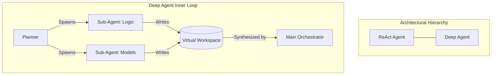

# Spring 2026 Project: Empirical Study of Deep Agents for Repository-Level QA

## 1. Introduction and Objectives
Welcome to the Bitirme Projesi (Capstone Project) for Spring 2026. This semester, six students will collaborate on a rigorous research-oriented project focused on **Repository-Level Code Question Answering (QA)**.

### The Problem
Traditional LLMs struggle with large-scale codebases. Even with long context windows (like Gemini's 1M+ tokens), feeding an entire repository into a single prompt is inefficient, prone to "lost in the middle" effects, and costly. 

### The Research Goal
Our objective is to conduct a **rigorous empirical study** comparing three distinct architectural approaches for answering complex questions about software repositories. The goal is to determine if the **Deep Agents** methodology—characterized by dynamic task decomposition and sub-agent spawning—outperforms standard RAG and ReAct patterns in terms of accuracy (Fidelity), reasoning depth, and token efficiency.

**The final deliverable is a working code (backend and frontend) and a scientific paper suitable for publication in an AI/Software Engineering conference.**

---

## 2. The Two Experimental Setups
Students will implement and evaluate two distinct configurations within a unified UI. We omit a simple single-turn RAG setup because previous research (such as the SWE-QA paper itself) has already established a baseline showing its limitations; thus, we focus on agentic frameworks.

### Setup 1: ReAct Agent (The Baseline)
- **Architecture:** A standard "Reason-then-Act" loop. 
- **Action Space:** Restricted to exactly three tools (as defined in the original SWE-QA paper): `read_file`, `get_repo_structure`, and `search_rag`.
- **Workflow:** The agent can call these tools multiple times in a continuous loop to navigate the codebase until it believes it has found the answer.
- **Library:** LangChain.
- **Pros/Cons:** Effective on smaller scopes, but easily gets lost in infinite "agent loops" or suffers from context overflow in massive repositories.

### Setup 2: Deep Agents (The Proposed Solution)
- **Architecture:** Multi-step hierarchical reasoning with **Planning, Virtual Filesystems, and Sub-Agents**.
- **Action Space:** Uses the default, expansive action space provided by the Deep Agents library.
- **Workflow:** 
    1. **Planner:** Decomposes the QA task into logical sub-tasks.
    2. **Sub-Agents:** The main agent spawns specialized "worker" agents for specific folders or modules.
    3. **Filesystem/Shell:** Agents don't just "read text"; they navigate the directory tree dynamically and synthesize information in isolated workspaces.
- **Library:** [LangChain Deep Agents](https://docs.langchain.com/oss/python/deepagents/overview).
- **Pros/Cons:** Handles long-horizon tasks better by isolating sub-problems, preventing context pollution in the main orchestrator.

---

## 3. Dataset: SWE-QA
We will evaluate these setups using the **SWE-QA Benchmark** (Software Engineering Question Answering).
- **Scope:** 12 massive open-source repositories (Django, Sympy, Matplotlib, etc.).
- **Scale:** Over 3 million lines of code in total.
- **Difficulty:** Questions require deep understanding of project architecture, not just local logic.
- **Reference:** [SWE-QA: A Large-Scale Benchmark for Repository-level Code QA](https://arxiv.org/abs/2509.14635)

---

## 4. Development Stack & "Vibe-Coding"
To maximize focus on architecture and experiments rather than boilerplate coding, students will utilize a modern AI-augmented stack.

### Context-Aware Development
- **Antigravity (using Gemini Pro Student Subscription)**
- **GitHub Copilot Pro:** Integration in VSCode (available through Github Student Developer Pack Subscription).
- **LLM API Funding:** Students should utilize the **$100 Azure credits** (provided via the GitHub Student Developer Pack) and the **$200 Google Cloud credits** to generate API keys and cover the costs of running LLM inference during their experiments.
- **MCP Servers (Model Context Protocol):**
    - **LangChain Docs MCP:** Allows your AI agents to query the latest LangChain/Deep-Agents documentation in real-time.
    - **DeepWiki MCP:** Provides specialized documentation on repository patterns.
    - **Research Tip:** When you encounter a library error, don't search Google manually. Ask your AI agent to ask the questions from DeepWiki or Lancghain Docs.

### UI & Customization
Students will fork and customize the [Deep-Agents UI](https://github.com/langchain-ai/deep-agents-ui). 
- **Task:** Enable a "Setup Selector" (Dropdown: ReAct / DeepAgent).

---

## 5. Experimental Study Framework & Evaluation Protocol
The core of our scientific contribution lies in comparing the performance of the two setups on the **SWE-QA** dataset.

### Efficiency Analysis
Before diving into human/LLM labeling, we will quantify the efficiency of the agents:
- **Plotting the Pareto Frontier:** We will not just report the final accuracy (`Pass@1`). Students must plot **Accuracy vs. Token Usage (Cost)** and **Accuracy vs. Time (Latency)**. 
- **Objective:** We hypothesize that while Deep Agents might take longer (latency), their token efficiency (cost) and accuracy will form a better Pareto frontier on complex repos compared to ReAct agents, which often burn millions of tokens in infinite loops.

### Evaluation Protocol: LLM + Human Labeling
We will evaluate the answers generated by each setup using both human and LLM raters.

#### 1. Labeling Categories
Each answer will be labeled as:
- **Fully Correct**
- **Partially Correct**
- **Incorrect**

#### 2. Raters
To ensure reliable results, every answer will be rated by:
- **3 Human Raters:** Students will manually review and label the answers.
- **3 different LLMs:** At least three different SOTA models (e.g., Gemini 3.1 Pro, GPT 5.4, Claude Opus 4.6 and etc) will also label the answers.

#### 3. Metrics and Agreement
- **Inter-Rater Agreement:** We will calculate **Cohen's Kappa** to measure the agreement level between the different raters (Human-to-Human, Human-to-LLM).
- **Aggregated Results:** These ratings will be used to compare the two setups (ReAct Agent vs. Deep Agent) across the entire SWE-QA dataset.

### Qualitative Error Taxonomy (Failure Mode Analysis)
To provide deep academic insight and answer *why* agents fail, students will categorize the "Incorrect" and "Partially Correct" responses into the following taxonomy:
- **Navigation/Search Failure:** The agent got stuck in a loop, searched the wrong directories, or failed to locate the relevant snippet entirely.
- **Context Overflow/Poisoning:** The agent pulled too many files into its context, lost track of the original question, and hallucinated an answer.
- **Synthesis/Reasoning Failure:** The agent found the exact necessary information but misunderstood the code logic or failed to deduce the correct answer.

By plotting these failure modes for ReAct vs. Deep Agents, the paper will demonstrate not just *if* Deep Agents are better, but *how* their hierarchical structure mitigates specific LLM weaknesses.

---

## 6. Justification for the Methodology
By moving from `smolagents` to **LangChain Deep Agents**, we are aligning with the current industry standard for production-grade multi-agent systems. The use of **SWE-QA** ensures our results are academically significant, as it is a far more challenging dataset than simple unit-test generation. Finally, the **MCP-driven development (Vibe-Coding)** allows students to operate as "Lead Architects," focusing on the *how* and *why* of agentic systems rather than getting stuck on syntax.

---

## 7. Open Science & Reproducibility
To ensure the study aligns with modern academic standards for top-tier publication, students must adhere to open science principles:
- **Maintain a Public GitHub Repository:** All source code, agent prompts, custom UI components, and evaluation scripts must be kept continually up-to-date in a specific repository.
- **Publish Data and Result Logs:** All raw outputs generated by the agents, the human/LLM labeling datasets, token usage logs, and trace logs must be made publicly available alongside the final paper.

---
> [!IMPORTANT]
> This document serves as the "Source of Truth" for the Spring 2026 project. All coding and experimental decisions should refer back to this context.
