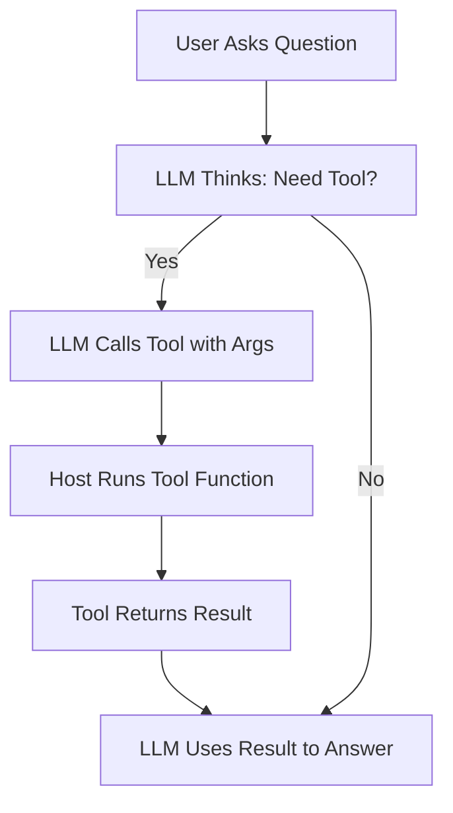
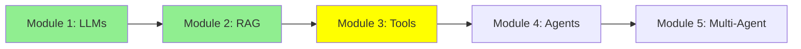

# Module 3: LLM Tool Calling

Hi! Modules 1 and 2 covered LLMs and RAG. Now, let's make LLMs do real actions, like reading files or running commands. This is "tool calling"—giving LLMs superpowers to interact with the world. Let's explore in more detail!

## I. What is an LLM Tool?

A **tool** is simply a function that you write in code. It's a normal Python function with a name, inputs, and outputs. The LLM doesn't run it directly—instead, based on what the user asks, the LLM decides if it needs to call one of your tools and provides the right inputs.

For example, you define a tool like `read_file(filename)`. The LLM sees the tool's description and, if the user says "Read the main.py file," the LLM calls it with `filename="main.py"`.

ASCII Art:
```
Tool Definition: def read_file(filename): ...
User: "Read main.py"
LLM: "Call read_file with 'main.py'"
Tool Runs: Returns file content
LLM: "File says: ..."
```

## II. Why Tool Calling is Important and Useful

### A. LLM Limitations

LLMs are powerful, but they have big limits:
- Their knowledge comes from training data, which is old and fixed.
- They can't get new info, like today's weather or latest news.
- They can't interact with the world—no sending emails, checking files, or running commands.

Without tools, LLMs are like smart but isolated brains.

### B. Expanding Capabilities

Tools fix these limits! They let LLMs:
- Access live, real-time info.
- Perform actions in the real world.

**Example 1: Web Search**
LLMs can't search the internet. But you can write a tool:
```python
def web_search(query):
    # Code to search Google or another engine
    return results
```
Now, the LLM can "search" by calling this tool.

**Example 2: Code Access**
LLMs can't read your local files. But with a tool:
```python
def read_file(filename):
    with open(filename, 'r') as f:
        return f.read()
```
The LLM can now "see" your code by calling `read_file("main.py")`.

Tools make LLMs active helpers, not just passive chatbots.

## III. Use Cases and Examples of Tools

Tools can do many things based on needs. Here are some examples:

- **Sending Emails**: A tool to send emails via SMTP.
- **Terminal Access**: Run shell commands, like `git log` or tests.
- **Getting Time**: Return current date/time.
- **Database Queries**: Write and run SQL on databases.
- **Vector DB Queries**: Search embeddings for RAG-like info.

For your projects, tools like read_file, run_shell, and query_vector_db are key for code tasks.

## IV. Why Tools Matter for Projects

Tools turn LLMs into smart assistants that:
- Handle complex tasks step by step.
- Access files, run code, search web.
- Make projects interactive and powerful.

Without tools, LLMs are just chatbots. With tools, they're agents!

## Mermaid Diagram: Tool Calling Flow



## Tutorial Progress



## Summary

Tools let LLMs act in the real world. You learned what they are, why they're useful, and examples. Next, agents combine everything!

**Quick Check**: Why do LLMs need tools?

Keep learning! 🚀
