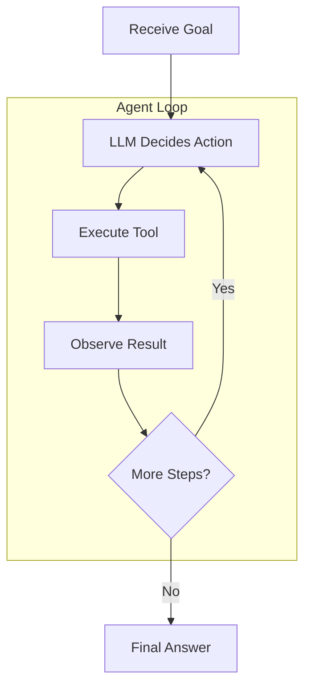
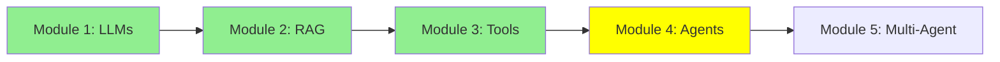

# Module 4: AI Agents: From Single Call to Multi-Step Reasoning

Hey there! We've built up from LLMs to RAG and tools. Now, agents—LLMs that think and act like smart helpers. Agents solve big problems step by step. Let's break it down!

## I. Introduction: Defining the Agent

### A. Beyond the Single Turn

LLMs handle simple questions, but complex tasks (like fixing bugs or analyzing codebases) need planning and actions. An **AI Agent** is an LLM with tools, memory, and a loop to reach goals.

### B. Analogy: LLM vs. Agent

- **LLM (The Brain)**: Inputs text, outputs text. Just one neural network run.
- **Agent (The Human Body/System)**: Wraps the LLM in a loop. Calls tools (hands), remembers (memory), keeps going until done.

Tools are the "hands"—functions for actions.

You can think of an LLM like a brain and an Agent like a human body, and Tools as the hands or feet of the human body.

  
*Everyone thinks agents are magic, but they're just smart LLM setups!*

  
*LLM as brain, agent as body!*

## II. The Core Mechanism: The Agent Loop

Agents use an **Observe-Decide-Act Loop** for multi-step thinking.

### A. Standard Observe-Decide-Act Flow

1. **Goal Received**: User sets objective (e.g., "Summarize API endpoints.").
2. **Decide/Plan**: LLM thinks, plans, picks a tool.
3. **Act**: Host runs the tool.
4. **Observe/Reflect**: Tool result added to memory.
5. **Re-Evaluate**: LLM checks progress, decides next step.
6. **Terminate**: Loop ends when goal met, LLM gives final answer.

### B. Detailed Multi-Step Example (Bug Fixing)

For "fix the bug in your code":

| Step | Agent Action | LLM Invocation |
|------|--------------|----------------|
| 0 | Goal received | - |
| 1 | Analyze code (use read_file tool) | Invoked to read files |
| 2 | Write test case | Invoked to generate code |
| 3 | Write fix code | Invoked to generate code |
| 4 | Run tests (use run_shell tool) | Invoked to call tool |
| 5 | Summarize if tests pass | Invoked to summarize |

Agents invoke LLMs multiple times; LLMs do it once.

This example shows that while a single LLM is invoked only for one time, the agent invokes LLMs multiple times to reach their goal (which is solving the bug) in multiple, controlled steps.

So in a simple manner we can say that:

- An LLM is just a neural networks that inputs text and output text.

- An Agent is an LLM that has access to tools, and is invoked within a loop multiple times until a goal is reached.

  
*See the steps in action!*

## III. Agent Components and Implementation

### A. Essential Components

- **LLM (The Brain)**: Reasons, plans, generates text.
- **Memory/Context**: Stores history for remembering.
- **Tools**: Functions for actions.

### B. Implementation Focus

Use frameworks like smol-agent for loops and tools. Focus on defining tools and prompts.

Libraries:
- [smolagents](https://github.com/huggingface/smolagents)
- [crewAI](https://github.com/crewAIInc/crewAI)
- [autogen](https://github.com/microsoft/autogen)

Basic code snippets (using a simple read_file tool):

**smolagents**:
```python
from smolagents import CodeAgent, tool, HfApiModel

@tool
def read_file(filename: str) -> str:
    with open(filename, 'r') as f:
        return f.read()

agent = CodeAgent(tools=[read_file], model=HfApiModel())
result = agent.run("Read main.py and summarize")
```

**crewAI**:
```python
from crewai import Agent, Task, Crew

def read_file(filename: str) -> str:
    with open(filename, 'r') as f:
        return f.read()

agent = Agent(role="Reader", goal="Read files", tools=[read_file])
task = Task(description="Read main.py", agent=agent)
crew = Crew(agents=[agent], tasks=[task])
crew.kickoff()
```

**autogen**:
```python
from autogen import AssistantAgent, UserProxyAgent

def read_file(filename: str) -> str:
    with open(filename, 'r') as f:
        return f.read()

assistant = AssistantAgent("Helper", llm_config={"config_list": [...]})
user_proxy = UserProxyAgent("User", code_execution_config={"functions": [read_file]})
user_proxy.initiate_chat(assistant, message="Read main.py")
```

  
*Agents in action!*

## Mermaid Diagram: Agent Loop



## Tutorial Progress



## Summary

Agents are LLMs in loops with tools and memory. They handle complex tasks. Next, multi-agent systems!

**Quick Check**: What's the agent loop?

Keep going! 🚀

**Next Module:** [Module 5: Multi-Agent Architectures](5_multi_agent.md)
